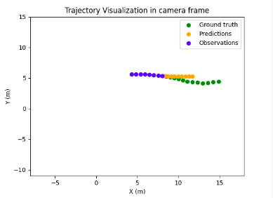
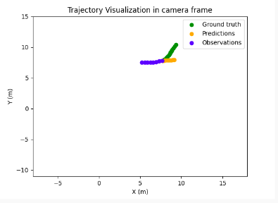
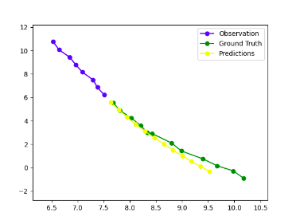
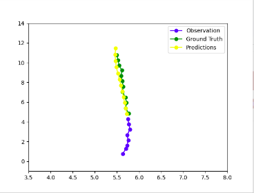

# Trajectory-Predictions

### *CS 541: Deep Learning - Worcester Polytechnic Institute, Spring 2023*
### Members: Febin Fredi, Nihal Suneel Navale, Puru Upadhyay

## Abstract
Predicting the trajectories of pedestrians is a difficult task since it depends on a number of external factors. The context of the scene and the interaction between pedestrians are two of the most important factors. Several methods have been explored in past to tackle this issue transitioning from physics-based models to data-driven models based on sequence based neural networks like RNNs. In this project we have compared the performance of Long-Short terms memory and Transformer Architectures. Since, attention is the most important aspect for trajectory prediction, spatial and temporal context of trajectory are taken into account for making future predictions in interaction aware LSTM and Transformer architecture.We use mean average
displacement and final average displacement as comparison metrics for architecture comparison.

## Setup/Run

We use Trajnet++ Dataset which can be downloaded from [here](https://github.com/vita-epfl/trajnetplusplusdata/releases/tag/v4.0)
The data is divided into train, validation and testing dataset. We use the training and validation data for training the model and validation after each epoch. The testing data can be ed for final testing but the predicted results are not available for checking accuracy of predictions.

For running training and testing for simple lstm model, run the following commands once data is saved in the vanilla-lstm folder under director data.
```
  cd vanilla-lstm
  mkdir data
  (place train, test, validation folder inside data folder)
  
  (For Taining the Model)
  python vlstm_train.py
  
  (For Testing the Model)
  python vlstm_test.py
```
For running training and testing for social lstm model, run the following commands once data is saved in the social-lstm folder under director data.
```
  cd social-lstm
  mkdir data
  (place train, test, validation folder inside data folder)
  
  (For Taining the Model)
  python train.py
  
  (For Testing the Model)
  python tes.tpy
```
For running training and testing for simple transformer model, run the following commands once data is saved in the Transformer folder under director data.
```
  cd Transformer
  mkdir data
  (place train, test, validation folder inside data folder)
  
  (For Taining the Model)
  python train.py
```

For running training and testing for social transformer model, run the following commands once data is saved in the STAR folder under director data.
```
  cd STAR
  mkdir data
  (place train, test, validation folder inside data folder)
  
  (For Taining the Model)
  python trainval.py
```


          


          

          


